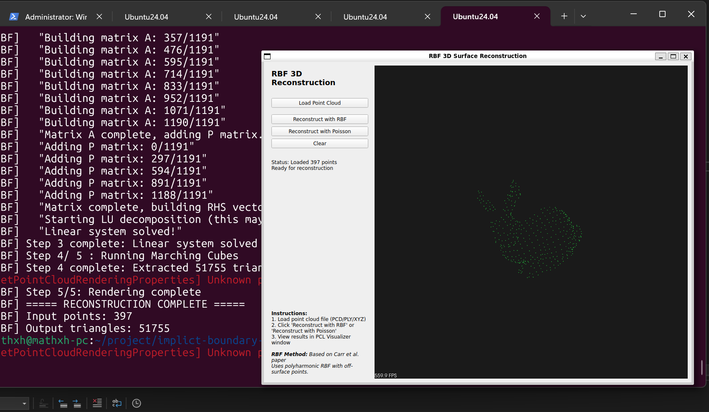
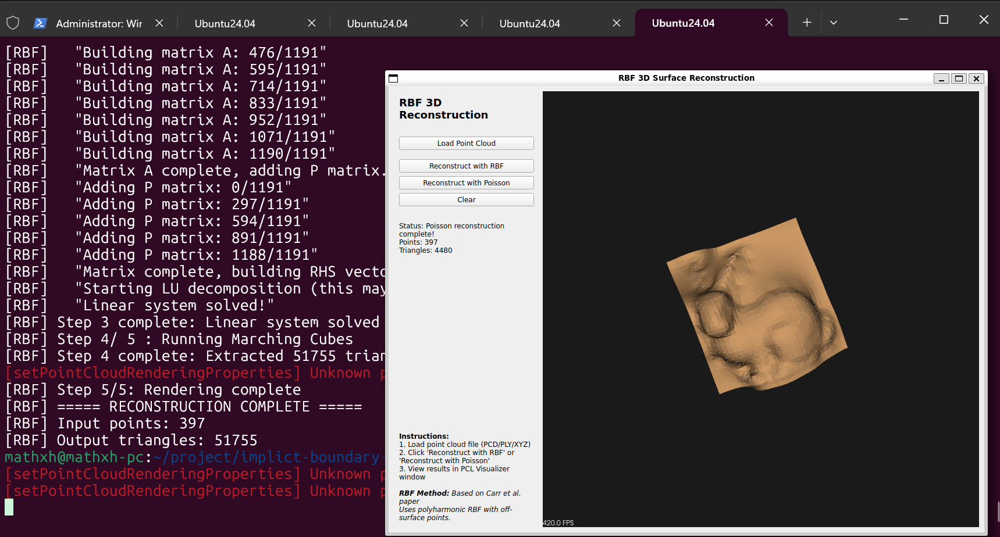
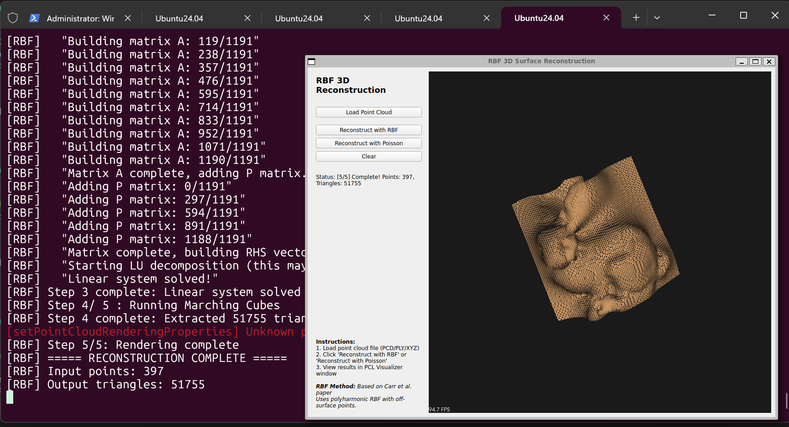

# RBF 3D 表面重建 (RBF 3D Surface Reconstruction)

基于径向基函数（RBF）的 3D 点云表面重建算法实现。

## 前言

为什么实现这个项目？是因为起因是有位国内自研BIM CAD软件的一位大佬，来我们院进行技术培训，它是做BIM软件地质算法相关的，培训讲解他们软件多牛逼时，顺带提了隐式建模的内容，给出一篇地质相关的隐式边界建模论文 [《Implicit Boundary Modeling with Radial Basis Functions》](https://geostatisticslessons.com/lessons/implicitrbf)（Sebastian Sanchez and Clayton V. Deutsch）, 并在他们的软件中实现了该算法，并且我跟他聊天的过程中，他说了RBF对比[Poisson重建](https://hhoppe.com/poissonrecon.pdf)的各种优点，， 我个人感觉他有点包装和炫耀个人技术嫌疑，并且他说的优点都是对比Poisson的缺点来说的，有点像学术界为了发篇论文而黑Poisson的感觉，Poisson也是著名大佬Hoppe的成果之一， 并且主流开源界都对Poisson算法进行了实现，并没有RBF的实现，我就觉得他的说法有点站不住脚，从工程上没说服我。或许RBF在地质建模上有优势吧，毕竟那片原始论文需要假定一个域标签，标记内域和外域，这样才可以重建表面，那篇论文本来就是地质相关的。我感觉就目前而言，在这个离线非实时场景，还是Poisson更好，难怪主流实现的都是Poisson重建，RBF可能需要用在其他地方吧。

所以我重新找了篇RBF的3D Object相关的论文来进行实现。

对了，Poisson重建的原始论文是 [《Poisson Surface Reconstruction》](https://hhoppe.com/poissonrecon.pdf) (Michael Kazhdan1, Matthew Bolitho1 and Hugues Hoppe, 2006) 

## 项目概述

本项目实现了论文 [《Reconstruction and Representation of 3D Objects with Radial Basis Functions》](https://www.cs.jhu.edu/~misha/Fall05/Papers/carr01.pdf)（J.C. Carr et al., SIGGRAPH 2001）中的核心算法，提供两种重建方法供对比：

- **RBF 重建**：基于多谐波 RBF 的隐式表面重建
- **Poisson 重建**：基于泊松方程的表面重建（PCL 实现）

## 运行截图



bunny原始PCD



Poisson重建结果



RBF重建结果


## 技术栈

- **语言**: C++
- **构建系统**: CMake
- **点云处理**: PCL
- **GUI**: Qt5
- **矩阵运算**: Eigen3

## 依赖库

### Ubuntu 24.04 安装命令

```bash
# PCL (点云库)
sudo apt install libpcl-dev pcl-tools

# Qt5 (GUI 框架)
sudo apt install qtbase5-dev

# Eigen3 (矩阵运算库)
sudo apt install libeigen3-dev
```

## 编译说明

```bash
mkdir build && cd build
cmake ..
make -j$(nproc)
./bin/rbf_implicit
```

## 使用说明

### 准备数据

支持点云格式：**PCD**、**PLY**、**XYZ**

测试数据位置：`test/data/`
- `bunny.pcd` - 斯坦福半边的兔子点云
- `ism_test_cat.pcd` - 猫点云

### 运行程序

1. 点击 **"Load Point Cloud"** 加载点云文件
2. 选择重建方法：
   - **"Reconstruct with RBF"** - RBF 3D 重建
   - **"Reconstruct with Poisson"** - Poisson 重建（对比）
3. 查看重建结果

### 界面功能

- **Load Point Cloud**: 加载点云文件
- **Reconstruct with RBF**: 执行 RBF 3D 表面重建
- **Reconstruct with Poisson**: 执行 Poisson 表面重建
- **Clear**: 清除所有数据

## RBF vs Poisson 对比

### 核心差异

| 特性 | RBF | Poisson |
|-----|-----|---------|
| **理论基础** | 全局插值，能量最小化 | 泊松方程重建 |
| **数学形式** | 隐式函数 s(x) = 0 | 等值面提取 |
| **输入要求** | 点云 + 法向量（自动估计） | 点云 + 法向量（自动估计） |
| **离面点** | 需要（沿法线投影生成） | 不需要 |
| **矩阵类型** | 稠密矩阵 (N+4)×(N+4) | 稀疏八叉树 |
| **求解器** | LU 分解（Eigen 多线程） | 稀疏求解器 |
| **计算复杂度** | O(N³) | O(N log N) |

### 优缺点对比

#### RBF 方法

**优点**：
- ✅ **最光滑插值**：能量最小化理论保证
- ✅ **孔洞修复能力强**：能够平滑填充大范围缺失数据
- ✅ **非均匀采样适应性好**：对稀疏和不规则数据鲁棒
- ✅ **法线可解析计算**：隐式函数梯度直接给出法线
- ✅ **全局一致性好**：单一函数表示整个物体
- ✅ **拓扑保持**：生成封闭、水密的流形网格

**缺点**：
- ❌ **计算慢**：O(N³) 复杂度，大规模数据不可行
- ❌ **内存占用大**：稠密矩阵需要 O(N²) 内存
- ❌ **数据规模限制**：基础版本仅支持 < 5000 点
- ❌ **矩阵可能病态**：某些配置下条件数过大

**适用场景**：
- 小规模点云（< 5000 点）
- 需要高质量光滑表面
- 有大孔洞需要修复
- 非均匀采样数据

#### Poisson 方法

**优点**：
- ✅ **计算速度快**：O(N log N) 复杂度
- ✅ **内存效率高**：稀疏矩阵，内存占用小
- ✅ **支持大规模数据**：可处理数十万点
- ✅ **实现成熟**：PCL 内置，经过广泛测试
- ✅ **可调分辨率**：通过 depth 参数控制细节

**缺点**：
- ❌ **孔洞修复能力有限**：倾向于封闭所有孔洞
- ❌ **过度平滑**：可能丢失尖锐特征
- ❌ **参数敏感**：depth、samplesPerNode 等参数影响结果
- ❌ **细节丢失**：低深度设置下丢失细节
- ❌ **法线质量依赖强**：错误的法线导致明显伪影

**适用场景**：
- 中大规模点云（> 5000 点）
- 需要快速重建
- 完整扫描数据（无大孔洞）
- 实时应用

## 项目结构

```
implict-boundary-rbf/
├── CMakeLists.txt                    # 构建配置
├── README.md                          # 本文件
├── doc/                               # 论文文档
│   ├── 3d-reconstruct-with-rbf.md     # RBF 3D 重建论文
│   └── research-report.md             # 研究报告
├── src/
│   ├── core/                          # 核心算法
│   │   ├── DistanceFunction.{h,cpp}   # 法向量估计和离面点生成
│   │   ├── RBFInterpolator.{h,cpp}    # RBF 插值器（多谐波 RBF）
│   │   └── MarchingCubes.{h,cpp}      # 等值面提取
│   ├── io/                            # 文件 I/O
│   │   └── PointCloudLoader.{h,cpp}   # 点云加载器
│   ├── gui/                           # GUI 界面
│   │   ├── MainWindow.{h,cpp}         # 主窗口
│   │   └── PointCloudViewer.{h,cpp}   # PCL Visualizer
│   └── main.cpp                       # 程序入口
├── test/data/                         # 测试数据
│   ├── bunny.pcd
│   └── ism_test_cat.pcd
└── build/
    └── bin/rbf_implicit               # 可执行文件
```

## 核心模块

### DistanceFunction

- 法向量估计（K 近邻）
- 法向量方向一致化（全部朝外）
- 离面点生成（沿法线投影）

### RBFInterpolator

- 多谐波 RBF：φ(r) = r 或 φ(r) = r³
- 增广线性系统求解 [A P; P^T 0]
- 多线程 LU 分解（Eigen）
- 进度回调支持

### MarchingCubes

- 标准 Marching Cubes 算法
- 可调节分辨率
- 生成封闭三角网格

## 已知问题

## 未来扩展

论文中提到但本基础版本未实现的优化：

1. **快速多极子方法（FMM）**：将评估复杂度降至 O(M + N log N)
2. **贪婪中心缩减**：减少 80-90% 的中心点数量
3. **紧凑支撑 RBF**：使矩阵变为稀疏矩阵

## 许可证

本项目仅用于学习和研究目的。

## 参考文献

1. **Carr, J.C., et al. (2001)**. Reconstruction and Representation of 3D Objects with Radial Basis Functions. SIGGRAPH 2001.

2. **Kazhdan, M., et al. (2006)**. Poisson Surface Reconstruction.

3. **Lorensen, W.E., & Cline, H.E. (1987)**. Marching Cubes: A high resolution 3D surface construction algorithm.
